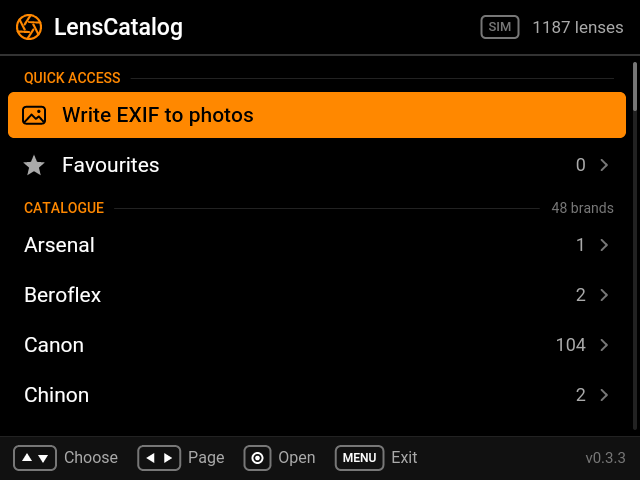
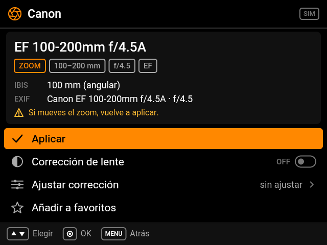

<p align="center">
  
</p>

<h1 align="center">LensCatalog</h1>

<p align="center">
  <b>Manual and adapted lenses, properly stabilised and tagged, on Sony cameras.</b>
</p>

<p align="center">
  <a href="https://github.com/Grohle-developer/lenscatalog/releases/latest"></a>
  <a href="LICENSE"></a>
  
  
  
</p>

<p align="center">
  <a href="https://buymeacoffee.com/grohle"></a>
</p>

---

A PlayMemories Camera App (PMCA) for the **Sony A7 II** (Android 2.3.7, API 10):
a catalog of manual and adapted lenses that injects EXIF data **before capture**
and sets the IBIS focal length — so vintage glass gets proper stabilization and
correct metadata. Java plus one small native library for the camera's settings
store. ~130 KB APK, v1-signed.

**Tested on the Sony A7 II only.** It is built on the PMCA framework, not on anything
specific to that body, so it should work on the other cameras that support PMCA apps
(see the requirements below), but that has not been tried on any of them.

 

## What it does

- Browse **1956 lenses across 62 brands** (M42, Pentax K, Minolta MD, Canon FD,
  Canon EF, Nikon F, Contax/Yashica, Olympus OM, Leica M, and more — every mount
  adaptable to Sony E), with max aperture for every entry.
- **One action applies everything**: sets the in-body stabilization focal length
  (`setAntiHandBlurFocalLength`) and writes pre-capture EXIF (`lensName`,
  focal length, aperture) via the Sony camera framework.
- **Zoom lenses**: no manual focal entry — the range goes into EXIF
  (e.g. `Canon EF 100-200mm f/4.5A`) and IBIS is set to the wide end, the safe
  choice (under-corrects instead of over-correcting if you zoom in later).
- **Prime lenses**: exact focal length to IBIS and EXIF.
- **Manual entry** for lenses not in the catalog (focal picker 4–1000 mm +
  optional max aperture; full custom naming by editing the JSON on a PC).
- **Favorites** and **last used** for one-tap re-apply in the field.
- **Manual lens correction** (v0.2.0): per-lens profiles for peripheral
  shading (brightness/red/blue, whole + mid zone), lateral chromatic
  aberration (red/blue) and distortion — the same model as Sony's own
  *Lens Compensation* PlayMemories app. Toggle it on the confirm screen,
  tune the 9 values in the built-in editor, and the app writes them via
  `setLensCorrection` / `setLensCorrectionLevel` when you apply the lens.
  Stored per lens on the camera; ranges are queried live from the framework.
- **Write EXIF to photos**: after shooting, tags the new photos on the card
  with the lens that was applied when each was taken (`LensMake`, `LensModel`,
  `LensSpecification`, `FNumber`, `MaxApertureValue`, plus `FocalLength` for
  primes), matched by the camera's own photo numbering:
  - **JPEG**: in the Exif IFD and in an embedded **XMP** packet (APP1),
    leaving the camera's own EXIF, thumbnail and file time untouched. The
    file is rewritten next to the original (`DSC02073.TMP`, an 8.3 name: the
    card accepts no other) and the original is never touched until the new
    one is in place.
  - **RAW (ARW)**: in the file's Exif IFD and in an embedded XMP (tag 0x02BC
    in IFD0), in place — the new Exif IFD, the XMP and a copy of IFD0 are
    appended and only the 4-byte IFD0 offset in the header changes, so the
    sensor data, Sony's MakerNote and SR2 block stay byte-identical (verified
    on a real A7 II ARW: same decode before and after) — and in an **XMP
    sidecar** next to it (`DSC01837.XMP`), which Lightroom, Bridge and
    Capture One read on import. An XMP that LensCatalog did not write, in
    the file or as a sidecar, is never overwritten.
  - The XMP says the lens in every vocabulary a reader is known to use:
    `exifEX:LensModel`/`LensMake`, Adobe's `aux:Lens`/`aux:LensInfo`, and
    `MicrosoftPhoto:LensModel`/`LensManufacturer` — the only source of
    Windows Explorer's "Lens model" and "Lens maker" fields, which read
    neither EXIF nor sidecars. Lightroom and macOS read EXIF `LensModel`
    (a photo already imported into Lightroom needs *Metadata › Read Metadata
    from File*); Capture One names Sony lenses from its own database, keyed on
    the MakerNote, and shows an adapted lens as the EXIF focal length and
    aperture. Sony's Imaging Edge may refuse an ARW another program wrote to.
- Fully navigable **without touch** (D-pad / center / MENU, control wheel and
  dials; ◀ ▶ pages through long lists, a held key repeats), in the visual
  language of Sony's native menus: black and Sony orange, a header that says
  where you are, drawn marks (the camera's font has no symbols), a legend of
  the keys on every screen, and colours exactly on the camera's 4-bit levels.
  Text is the bundled Roboto.
- Bring your own catalog: drop a `LENSES.JSN` (the card holds 8.3 names only;
  a `lenses.json` copied from a computer shows there as `LENSES~1.JSO`, which
  is accepted too) in `/DCIM/LENSES/` on the memory card and the app prefers
  it over the built-in one.

## Requirements

- Sony A7 II (any PMCA-capable pre-2018 Sony camera with framework API 2.10
  should work; only the A7 II is targeted).
- Install via [Sony-PMCA-RE](https://github.com/ma1co/Sony-PMCA-RE)
  (`pmca-console install -f lenscatalog.apk` or the GUI).

## Build

```bash
cd app
./build.sh   # -> out/lenscatalog.apk
```

Toolchain: JDK (`javac --release 8`), Android NDK **r16b** for `liblcstore.so`
(optional: without it the APK is built without the settings store), Android SDK **build-tools 30.0.3**
(`aapt`, `d8 --min-api 10`, `zipalign`, `apksigner`), platform `android-28`.
The APK is signed v1-only — the camera's Android 2.3.7 knows no other scheme.
Override via `JAVA_HOME`, `ANDROID_SDK`, `ANDROID_NDK`, `BUILD_TOOLS`, `PLATFORM_JAR`.
Set `ANDROID_KEYSTORE_B64` (+ password/alias vars) to sign with a real key;
otherwise a throwaway debug key is generated.

### Signing key (DO NOT REGENERATE)

`app/debug.keystore` is the **production signing key**, committed to the repo
so every dev builds update-compatible APKs. Details:
- Alias: `lenscatalog`, passwords: `android` / `android`
- Certificate: SHA256withRSA, fingerprint
  `13:39:05:BE:28:CF:B5:71:8B:00:E4:DA:22:90:80:66:61:A0:C6:B7:09:DA:52:48:EB:5D:FE:2E:95:D6:2A:C2`
- The camera rejects SHA-384 certificates and `jarsigner` output;
  `build.sh` pins `-sigalg SHA256withRSA` and uses `apksigner` (v1 only).

Regenerating this key breaks updates: the camera refuses to install an APK
signed with a different key over the existing install (error 504). If the
key is lost, users must uninstall first. A backup lives at
`~/workspace/a7ii-fw/lenscatalog-keystore-backup-2026-10-06.keystore`
(dev machine only, not in git).

`app/tools/api-check.py` verifies every platform call exists on API 10.
`app/test/exif-test.sh` tests the EXIF writer on camera-like JPEGs and ARWs
(javac + python3/PIL + exiftool; `ARW_SAMPLE=<file.ARW>` adds a real raw file,
checked to decode identically with rawpy), including the embedded XMP and,
through an `LD_PRELOAD` shim (`app/test/rename_shim.c`), a card that refuses
to rename: the photograph must come out tagged or byte-identical, never lost.
`app/tools/icon.py` draws the launcher icon.

`./tour.sh` runs the whole workflow on the A7 II simulator of
[aintfilm-sony](https://github.com/Grohle-developer/aintfilm-sony)
(`AINTFILM_SONY=<checkout>`; `sim/sim.sh setup` once): catalogue, favourites,
lens correction, zoom, manual data, simulated shots (one RAW+JPEG;
`LC_ARW=<file.ARW>` uses a real raw file), Write EXIF (the photos'
EXIF checked with exiftool), diagnostics, log, an electronic lens, a card
catalogue, wheel, paging and auto-exit, with screenshots in `out/tour/shots`.

## Status

UI and the full workflow are verified in the simulator (`tour.sh`, see `shots/`). The Sony framework
calls (`getLensInfo`, `setAntiHandBlurFocalLength`, `setExifInfo`) degrade to
log lines there — **on-camera verification is still pending**: whether
`lensName` lands in EXIF `LensModel` (0xA434), whether `setExifInfo` persists
across shots, and exact `writeMode` behavior. See `NOTAS.md` (developer notes,
in Spanish) for the full verification matrix.

## Acknowledgments

This project stands on the shoulders of giants:

- **The PMCA community, and [ma1co](https://github.com/ma1co)** — author of
  [Sony-PMCA-RE](https://github.com/ma1co/Sony-PMCA-RE). Without his work
  reverse-engineering Sony's installer and camera protocols, no custom app
  could ever reach these cameras. Enormous contribution, enormously grateful.
- **[voxivoid](https://github.com/voxivoid), author of
  [RecipeLab](https://github.com/voxivoid/recipe-lab-sony-pmca)** — for proving
  the modern build recipe this project's `build.sh` adapts (JDK + `d8`
  targeting API 10 + v1-only signing on current toolchains). Huge thanks for
  documenting the path.
- **[Roboto](https://github.com/googlefonts/roboto)** (Apache-2.0, Google) — the
  UI font, bundled in `app/assets/fonts` with its licence.
- **The [Lensfun](https://lensfun.github.io) project** — the built-in lens
  database was compiled from factual lens specifications (brand, model, mount,
  focal length, aperture) in the Lensfun database (CC BY-SA 3.0); the source
  is attributed per-entry in `lenses.json`.

## License

MIT — see [LICENSE](LICENSE). The bundled Roboto font is Apache-2.0
(`app/assets/fonts/Roboto-LICENSE.txt`).
