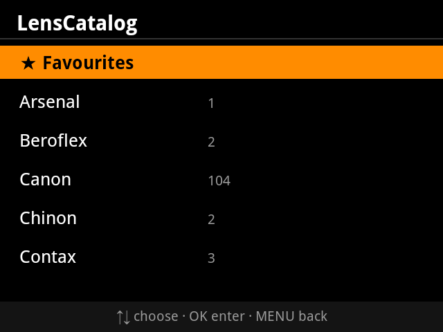

# LensCatalog

A PlayMemories Camera App (PMCA) for the **Sony A7 II** (Android 2.3.7, API 10):
a catalog of manual and adapted lenses that injects EXIF data **before capture**
and sets the IBIS focal length — so vintage glass gets proper stabilization and
correct metadata. Pure Java, no JNI. ~56 KB APK, v1-signed.



## What it does

- Browse **1187 lenses across 48 brands** (M42, Pentax K, Minolta MD, Canon FD,
  Canon EF, Nikon F, Contax/Yashica, Olympus OM, Leica M, and more — every mount
  adaptable to Sony E), with max aperture for every entry.
- **One action applies everything**: sets the in-body stabilization focal length
  (`setAntiHandBlurFocalLength`) and writes pre-capture EXIF (`lensName`,
  focal length, aperture) via the Sony camera framework.
- **Zoom lenses**: no manual focal entry — the range goes into EXIF
  (e.g. `Canon EF 100-200mm f/4.5A`) and IBIS is set to the wide end, the safe
  choice (under-corrects instead of over-correcting if you zoom in later).
- **Prime lenses**: exact focal length to IBIS and EXIF.
- **Manual entry** for lenses not in the catalog (focal picker 4–1000 mm +
  optional max aperture; full custom naming by editing the JSON on a PC).
- **Favorites** and **last used** for one-tap re-apply in the field.
- **Manual lens correction** (v0.2.0): per-lens profiles for peripheral
  shading (brightness/red/blue, whole + mid zone), lateral chromatic
  aberration (red/blue) and distortion — the same model as Sony's own
  *Lens Compensation* PlayMemories app. Toggle it on the confirm screen,
  tune the 9 values in the built-in editor, and the app writes them via
  `setLensCorrection` / `setLensCorrectionLevel` when you apply the lens.
  Stored per lens on the camera; ranges are queried live from the framework.
- Fully navigable **without touch** (D-pad / center / menu keys), in the visual
  language of Sony's native menus.
- Bring your own catalog: drop a `lenses.json` in `/DCIM/LENSES/` on the memory
  card and the app prefers it over the built-in one.

## Requirements

- Sony A7 II (any PMCA-capable pre-2018 Sony camera with framework API 2.10
  should work; only the A7 II is targeted).
- Install via [Sony-PMCA-RE](https://github.com/ma1co/Sony-PMCA-RE)
  (`pmca-console install -f lenscatalog.apk` or the GUI).

## Build

```bash
cd app
./build.sh   # -> out/lenscatalog.apk
```

Toolchain: JDK (`javac --release 8`), Android SDK **build-tools 30.0.3**
(`aapt`, `d8 --min-api 10`, `zipalign`, `apksigner`), platform `android-28`.
The APK is signed v1-only — the camera's Android 2.3.7 knows no other scheme.
Override via `JAVA_HOME`, `ANDROID_SDK`, `BUILD_TOOLS`, `PLATFORM_JAR`.
Set `ANDROID_KEYSTORE_B64` (+ password/alias vars) to sign with a real key;
otherwise a throwaway debug key is generated.

`app/tools/api-check.py` verifies every platform call exists on API 10.

A device simulator from the PMCA template setup runs the APK on a PC for
UI testing without a camera: `sim.sh install <apk>`.

## Status

UI and logic are verified in the simulator (see `shots/`). The Sony framework
calls (`getLensInfo`, `setAntiHandBlurFocalLength`, `setExifInfo`) degrade to
log lines there — **on-camera verification is still pending**: whether
`lensName` lands in EXIF `LensModel` (0xA434), whether `setExifInfo` persists
across shots, and exact `writeMode` behavior. See `NOTAS.md` (developer notes,
in Spanish) for the full verification matrix.

## Acknowledgments

This project stands on the shoulders of giants:

- **The PMCA community, and [ma1co](https://github.com/ma1co)** — author of
  [Sony-PMCA-RE](https://github.com/ma1co/Sony-PMCA-RE). Without his work
  reverse-engineering Sony's installer and camera protocols, no custom app
  could ever reach these cameras. Enormous contribution, enormously grateful.
- **[voxivoid](https://github.com/voxivoid), author of
  [RecipeLab](https://github.com/voxivoid/recipe-lab-sony-pmca)** — for proving
  the modern build recipe this project's `build.sh` adapts (JDK + `d8`
  targeting API 10 + v1-only signing on current toolchains). Huge thanks for
  documenting the path.
- **The [Lensfun](https://lensfun.github.io) project** — the built-in lens
  database was compiled from factual lens specifications (brand, model, mount,
  focal length, aperture) in the Lensfun database (CC BY-SA 3.0); the source
  is attributed per-entry in `lenses.json`.

## License

MIT — see [LICENSE](LICENSE).
